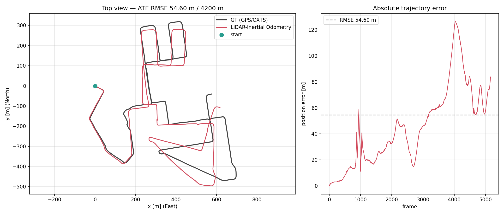

# Point-to-Plane ICP / IMU Preintegration / LiDAR-Inertial Odometry

Three connected pieces: a point-to-plane ICP solved with Ceres on an analytic Jacobian, an IMU
preintegration class, and a LiDAR-inertial odometry that runs both on a KITTI bag.

**Environment** — Ceres 2.1.0, Eigen 3.4.0, C++17, ROS1 Noetic (part 3 only).

```text
src/
├── point-to-plane-icp/      # part 1 -- standalone CMake project, no ROS
├── lidar_inertial_odometer/ # part 3 -- catkin package, contains part 2
├── data/                    # 2011_09_30_drive_0028.bag
├── docs/                    # assignment and the hand derivations
└── docker/                  # dev container (run.sh / exec.sh)
```

---

## Part 1 — Point-to-Plane ICP

### Residual

The error vector of one correspondence, and the residual it reduces to:

```text
e_n = R(theta) x_n + t - y_n           R(theta) = Rz(gamma) Ry(beta) Rx(alpha)
r_n = n_y^T e_n
```

`r_n` is a 1-D scalar, the signed distance from the transformed source point to the tangent plane of
its target point. Only the **target** normal `n_y` appears — the source normal is used nowhere in the
residual, only to reject correspondences whose normals disagree.

### Jacobian

The parameter block is `xi = [tx, ty, tz, alpha, beta, gamma]^T`, so the Jacobian is one row:

```text
J_n = [ n_y.x, n_y.y, n_y.z,
        n_y^T (dR/dalpha) x_n, n_y^T (dR/dbeta) x_n, n_y^T (dR/dgamma) x_n ]  in R^{1x6}
```

The translation block is just `n_y^T`, since `de/dt = I`. The three rotation derivatives are expanded
entry by entry in [rotation.cpp](point-to-plane-icp/src/rotation.cpp).

| Formula | Code in `PointToPlaneCostFunction::Evaluate()` |
|---|---|
| `r_n = n_y^T(R x_n + t - y_n)` | `residuals[0] = target_normal_.dot(rotation * source_point_ + translation - target_point_);` |
| `dr/dt = n_y^T` | `jacobian[0..2] = target_normal_.x(), .y(), .z();` |
| `dr/dalpha = n_y^T(dR/dalpha)x_n` | `jacobian[3] = target_normal_.dot(rotation_derivative_alpha(a,b,g) * source_point_);` |
| `dr/dbeta = n_y^T(dR/dbeta)x_n` | `jacobian[4] = target_normal_.dot(rotation_derivative_beta(a,b,g) * source_point_);` |
| `dr/dgamma = n_y^T(dR/dgamma)x_n` | `jacobian[5] = target_normal_.dot(rotation_derivative_gamma(a,b,g) * source_point_);` |

`AutoDiffCostFunction` and `NumericDiffCostFunction` are not used — the Jacobian above is written out
by hand in `Evaluate()`.

### The ICP loop

Each outer iteration relinearizes: transform the source by the current pose, search correspondences
again, then let Ceres solve for an **increment** `xi` starting from 0.

Two details worth knowing:

- **Increment, not absolute pose.** Restarting `xi` from 0 each iteration keeps the Euler angles near
  0, so `beta = ±pi/2` gimbal lock is never reached.
- **Rotation pivot at the centroid.** Rotating about the source centroid instead of the origin leaves
  the residual and the Jacobian unchanged, but decorrelates the rotation columns of `J` from the
  translation columns. On the provided data `cond(J^T J)` drops from 7.3e5 to 9.2.

Correspondences are rejected on distance and on normal disagreement, and the outer loop stops on a
small step or a stalled error. Ceres' own `termination_type` is not enough, because a new
correspondence set is a different objective.

| Requirement | Where |
|---|---|
| `ceres::SizedCostFunction` subclass, residual + analytic Jacobian in `Evaluate()` | [point_to_plane_cost.hpp](point-to-plane-icp/include/p2p_icp/point_to_plane_cost.hpp) |
| source / target input interface | `IcpPointToPlane::set_source() / set_target() / do_icp()` — [icp_point_to_plane.hpp](point-to-plane-icp/include/p2p_icp/icp_point_to_plane.hpp) |
| nearest-neighbour correspondence search | hand-written kd-tree — [kdtree.hpp](point-to-plane-icp/include/p2p_icp/kdtree.hpp) |
| pose optimization / convergence / iteration | [icp_point_to_plane.cpp](point-to-plane-icp/src/icp_point_to_plane.cpp) |
| final relative pose (R, t) | `IcpResult::transform` (`Eigen::Isometry3d`) |
| test code | [test/test_icp.cpp](point-to-plane-icp/test/test_icp.cpp) |

### Build and run

```bash
cd point-to-plane-icp
cmake -S . -B build -DCMAKE_BUILD_TYPE=Release
cmake --build build -j$(nproc)

./build/icp_demo           # demo output
ctest --test-dir build -V  # or ./build/test_icp
```

Needs C++17, CMake ≥ 3.16, Eigen 3.4, Ceres ≥ 2.1, and GoogleTest for the test. Without GoogleTest
only the test target is skipped.

### Result

```text
iter  corr     rms error before [m]     rms error after [m]      |dt| [m]     |dR| [rad]
--------------------------------------------------------------------------------------------
0     300      1.601561737804692e-01    3.372609504156267e-02    2.5103e-01   5.1514e-03
1     300      1.766086787058824e-02    1.776356839400250e-15    8.0936e-02   5.1514e-03
2     300      1.776356839400250e-15    0.000000000000000e+00    3.0762e-15   6.0142e-19

converged            : yes after 3 iteration(s)
final correspondences: 300 / 300 source points
final error (rms)    : 0.000000000000000e+00 [m]

final relative pose (source -> target):
  t = [-0.200000000000, -0.200000000000, -0.000000000000]  [m]
  euler ZYX (alpha, beta, gamma) = [ 0.000000000000, -0.000000000000,  0.000000000000]  [rad]
  R = I
```

It recovers the ground truth `t = (-0.2, -0.2, 0.0)` and converges to `final_error` of 0 (or 1e-16
order), far tighter than the test's `kEpsilon = 1e-6`. Full output in
[docs/run_output.txt](point-to-plane-icp/docs/run_output.txt) and
[docs/test_output.txt](point-to-plane-icp/docs/test_output.txt).

> The `error after` of `iter 0` (3.37e-2) differing from the `error before` of `iter 1` (1.77e-2) is
> expected: the correspondences are re-searched between the two, so they are errors over different
> correspondence sets.

---

## Part 2 — IMU Preintegration

### What it computes

Naively accumulating the discrete kinematics from `k = i` to `j-1` leaves the absolute state `R_k` on
the right hand side, so every change of `R_i` during optimization forces a re-integration. Defining
relative quantities instead removes it:

```text
dR_ij = R_i^T R_j                                 = prod_k Exp([w_k dt]x)
dv_ij = R_i^T (v_j - v_i - g dt)                  = sum_k dR_ik a_k dt
dp_ij = R_i^T (p_j - p_i - v_i dt - 0.5 g dt^2)   = sum_k [ dv_ik dt + 0.5 dR_ik a_k dt^2 ]
```

Neither the absolute state nor gravity survives on the right, so the integration never has to be
redone. They reappear only in `predict()`, which solves the same definitions for `R_j, v_j, p_j`.

### Implementation

[`ImuPreintegrator`](lidar_inertial_odometer/include/lidar_inertial_odometer/imu_preintegrator.hpp)
implements this directly, and part 3's odometry uses it.

- Integrated as a recursion rather than as sums. The order `dp -> dv -> dR` matters, because `dp` and
  `dv` must both read the pre-update `dR`.
- `dR` is re-projected onto SO(3) every step, so numerical drift cannot break orthogonality.
- `delta_at(t)` returns the partial delta at any time inside the interval, which is what deskewing
  queries per point (slerp for rotation, linear for the rest).
- The SO(3) helpers (`Hat`, `Exp`, `Log`) are written out in
  [so3.hpp](lidar_inertial_odometer/include/lidar_inertial_odometer/so3.hpp).

Self-checks against synthetic data
([test_lio_core.cpp](lidar_inertial_odometer/test/test_lio_core.cpp)):

| Check | Result |
|---|---|
| `predict()` matches a direct integration of the kinematics | 2.6e-14 m |
| definitions of the deltas == the recursion's result | 2.5e-14 |
| `delta_at(t)` matches an integration up to `t` | 0 |

---

## Part 3 — LiDAR-Inertial Odometry (KITTI)

### Pipeline

```text
IMU 100 Hz ──► imu_queue_ ──► ImuPreintegrator ──► predicted pose ──┐
                                     ▲                              │ initial_guess
                                     │ velocity update              ▼
LiDAR 10 Hz ──► scan_queue_ ──► deskew ──► FeatureExtractor ──► IcpPointToPlane(local map)
                                                                    │
                                                                 T_icp ──► state update
```

Both inputs are queues. `AddImu()` and `AddLidarScan()` append to their queue and then process
whatever has become ready. A scan is ready once the IMU queue reaches the **end of that scan's
sweep**, since deskewing needs the motion across the whole sweep — that IMU arrives around the time
of the next scan, which is the one frame of latency seen when replaying a rosbag.

Per scan: preintegrate the IMU into a predicted pose → preprocess (64 → 32 channels) → deskew →
planar features + PCA normals → scan-to-map point-to-plane ICP against the local map → update the
state → add to the local map if it is a keyframe.

### The pieces

- **Preprocessing.** `ring` selects the channel band; the default keeps the middle 32 of the 64
  channels. Range, height and NaN filters run here too, and `ring` / `rel_time` are recovered from
  the vertical angle and azimuth when the bag lacks those fields.
- **Deskew.** Each point is moved back into the lidar frame at the scan start time. Because `dp` is
  by definition free of gravity and initial velocity, both are added back to recover the displacement
  the vehicle actually travelled.
- **Normals.** KITTI clouds carry none, but point-to-plane ICP needs one per target point. Two
  methods: LOAM scan-line curvature, or neighbourhood covariance PCA (default). Both fit the normal
  by PCA over a fixed-radius neighbourhood, and accept it only when the plane residual `sqrt(l0)` is
  small and `l0/l1` says the normal direction is unique.
- **Local map.** A sliding window of keyframes, merged and voxel downsampled, is the ICP target. A
  window rather than a global map keeps the kd-tree size constant and stops drifted old observations
  from pulling on the current registration.
- **ICP gating.** A result too far from the IMU prediction is dropped in favour of the prediction.
- **Velocity feedback.** The ICP position residual corrects `v_i`. Its lever arm is `dt + T/2`, not
  `dt`, because deskewing removes `R_i^T v tau` per point and so shrinks the displacement ICP reports;
  using `dt` would inflate the gain by 1.5x on KITTI and make the velocity oscillate.

| Requirement | Implementation |
|---|---|
| preprocess 64-channel LiDAR down to ~32 | `FeatureExtractor::Preprocess()` selects by `ring`; default drops 16 below and 16 above |
| IMU preintegration written as a class | [`ImuPreintegrator`](lidar_inertial_odometer/include/lidar_inertial_odometer/imu_preintegrator.hpp) |
| reuse the part 1 ICP | `../point-to-plane-icp` referenced by source from CMake, not copied |
| ROS only as the I/O interface | ROS code lives only in [lio_node.cpp](lidar_inertial_odometer/src/lio_node.cpp); the algorithms are in `lio_core`, which has zero ROS dependency |
| Ceres 2.1.0 / Eigen 3.4.0  | versions pinned via `find_package`; kd-tree, voxel grid and PointCloud2 parsing all hand-written |

### Build and run (catkin)

This package and `point-to-plane-icp` must sit side by side under the catkin workspace's `src/`. The
provided docker environment (`docker/run.sh`) already has that layout.

```bash
cd /home/clobot_assignment/dev_ws
catkin_make -DCMAKE_BUILD_TYPE=Release
source devel/setup.bash

roslaunch lidar_inertial_odometer kitti_lio.launch
```

Use `-DP2P_ICP_DIR=/path/to/point-to-plane-icp` if it lives elsewhere. The KITTI bag is ROS1 format
and is used as is. The main launch arguments are `rate` (replay speed, default 0.5), `duration`,
`ring_selection` and `normal_method`.

The self-check binary needs no rosbag:

```bash
./devel/lib/lidar_inertial_odometer/test_lio_core
```

### Trajectory (top view, estimate vs GT)

Over the full bag: 5162 frames, 4200 m travelled.



| Image | ATE RMSE | vs distance travelled |
|---|---|---|
| [trajectory_top_view.png](lidar_inertial_odometer/results/trajectory_top_view.png) — direct comparison | 54.60 m | 1.30 % |
| [trajectory_top_view_aligned.png](lidar_inertial_odometer/results/trajectory_top_view_aligned.png) — `--align` (after SE(2) Umeyama fit) | 35.22 m | 0.84 % |

With `use_imu_orientation_for_yaw: true` (the default) the world frame is aligned to ENU using the
OXTS absolute heading, so both trajectories come out in the same frame. The raw trajectories (TUM
format) are [lio_trajectory.txt](lidar_inertial_odometer/results/lio_trajectory.txt) and
[lio_gt.txt](lidar_inertial_odometer/results/lio_gt.txt); the plots come from
[plot_trajectory.py](lidar_inertial_odometer/scripts/plot_trajectory.py).

```bash
python3 src/lidar_inertial_odometer/scripts/plot_trajectory.py \
    --est /tmp/lio_trajectory.txt --gt /tmp/lio_gt.txt \
    --out src/lidar_inertial_odometer/results/trajectory_top_view.png
```

Every parameter and the reasoning behind its value is in
[config/kitti.yaml](lidar_inertial_odometer/config/kitti.yaml).
